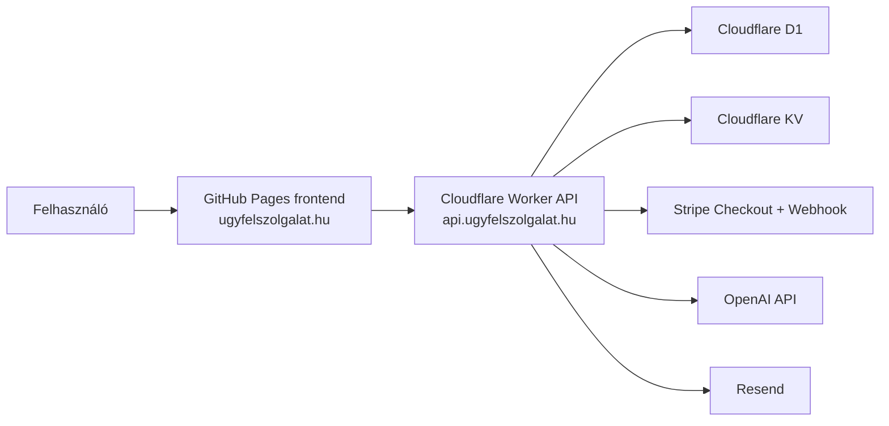

# Ügyfélközpont

„Megírjuk Ön helyett a nehéz leveleket.”

Az **Ügyfélközpont** egy magyar nyelvű, fizetős levélíró MVP. A felhasználó leírja a problémáját, Stripe Checkouttal fizet, majd kizárólag igazolt sikeres fizetés után kap hivatalos, udvarias és határozott hangvételű levelet.

## 1. Mi ez a projekt?

- fizetős problémamegoldó levélíró szolgáltatás
- nem általános chatbot
- React + Vite frontend
- Cloudflare Workers backend
- Cloudflare D1 adatbázis
- opcionális Cloudflare KV rate limithez
- Stripe Checkout fizetés
- OpenAI-alapú levélgenerálás és hibrid minőségellenőrzés

## 2. Architektúra



## 3. Miért nem fut backend GitHub Pages-en?

A GitHub Pages statikus hosting. Nem alkalmas szerveroldali API-kulcsok, Stripe webhook-verifikáció, D1-hozzáférés vagy OpenAI-kulcs biztonságos kezelésére. Emiatt:

- frontend: GitHub Pages
- backend: Cloudflare Workers
- adatbázis: Cloudflare D1

## 4. GitHub Pages frontend deploy

1. A repository `Settings > Pages` részében engedélyezze a GitHub Actions alapú deployt.
2. Állítsa be a saját domaint: `ugyfelszolgalat.hu`.
3. A `.github/workflows/deploy-frontend.yml` buildeli a `frontend` workspace-et és publikálja a `frontend/dist` könyvtárat.
4. Állítsa be GitHub secretként:
   - `VITE_TURNSTILE_SITE_KEY`

## 5. Cloudflare Worker backend deploy

1. Lokális fejlesztéshez másolja a `worker/wrangler.toml.example` fájlt `worker/wrangler.toml` néven.
2. GitHub Actions deploynál a workflow a GitHub Variables alapján generálja a `worker/wrangler.toml` fájlt, ezért D1/KV azonosítót nem kell a repositoryba commitolni.
3. Állítsa be a Worker secretjeit Wranglerrel vagy GitHub Actionsből.
4. A `.github/workflows/deploy-worker.yml` typechecket, teszteket és deployt futtat.

## 6. Cloudflare D1 létrehozás

```bash
npx wrangler d1 create ugyfelkozpont
```

A kapott `database_id` kerüljön a `worker/wrangler.toml` fájlba.

## 7. D1 migráció futtatása

```bash
npx wrangler d1 migrations apply ugyfelkozpont --remote --config worker/wrangler.toml
```

Lokálisan:

```bash
npx wrangler d1 migrations apply ugyfelkozpont --local --config worker/wrangler.toml
```

## 8. Cloudflare KV opcionális rate limithez

```bash
npx wrangler kv namespace create RATE_LIMIT_KV
```

A létrejött namespace ID kerüljön a `worker/wrangler.toml` megfelelő bindingjába.

## 9. Stripe Checkout beállítás

- Basic és premium csomag: egyszeri fizetés
- Business csomag: havi előfizetés, 10 levél / hó
- Pénznem: `HUF`
- A frontend csak `packageId`-t küld; az ár minden esetben szerveroldalon dől el.

## 10. Stripe webhook beállítás

Webhook endpoint:

```text
https://api.ugyfelszolgalat.hu/api/stripe/webhook
```

Kezelt események:

- `checkout.session.completed`
- `checkout.session.expired`
- `payment_intent.payment_failed`
- `charge.refunded`
- `invoice.paid`
- `invoice.payment_failed`
- `customer.subscription.updated`
- `customer.subscription.deleted`

## 11. Stripe webhook secret beállítás

A Stripe dashboardból másolja ki a signing secretet, majd állítsa be:

```bash
npx wrangler secret put STRIPE_WEBHOOK_SECRET --config worker/wrangler.toml
```

## 12. Apple Pay / Google Pay megjegyzés

A Stripe Checkout képes Apple Pay és Google Pay megjelenítésére, ha:

- a Stripe-fiókban engedélyezett
- a domain ellenőrzött
- a böngésző, eszköz és felhasználói konfiguráció támogatja

## 13. OpenAI API kulcs beállítás

```bash
npx wrangler secret put OPENAI_API_KEY --config worker/wrangler.toml
```

Alap modell:

```text
OPENAI_MODEL=gpt-5-nano
```

Opcionális review modell:

```text
OPENAI_REVIEW_MODEL=gpt-5-nano
```

## 14. Turnstile beállítás

- frontend site key: `VITE_TURNSTILE_SITE_KEY`
- Worker secret: `TURNSTILE_SECRET_KEY`
- a tokeneket a Worker minden publikus beküldésnél újraellenőrzi

## 15. Saját domain beállítás GitHub Pageshez

- frontend domain: `ugyfelszolgalat.hu`
- DNS-ben a GitHub Pages által kért rekordokat kell beállítani
- a Pages felületen kapcsolja be a HTTPS-t

## 16. API subdomain beállítás Cloudflare Workerhöz

- API domain: `api.ugyfelszolgalat.hu`
- a Worker route vagy custom domain erre mutasson
- a `SITE_URL` értéke `https://ugyfelszolgalat.hu`

## 17. GitHub Actions secret beállítás

Kötelező:

- `CLOUDFLARE_API_TOKEN`
- `CLOUDFLARE_ACCOUNT_ID`
- `STRIPE_SECRET_KEY`
- `STRIPE_WEBHOOK_SECRET`
- `OPENAI_API_KEY`
- `TURNSTILE_SECRET_KEY`
- `TOKEN_HASH_SECRET`
- `RESEND_API_KEY`
- `VITE_TURNSTILE_SITE_KEY`
- `DEMO_ACCESS_CODE`, csak akkor, ha demó módot is szeretne távoli teszteléshez

Fontos: a Worker secret értékeket nem szabad frontend env változóba tenni. A deploy workflow a GitHub Secretsből `wrangler secret bulk` paranccsal szinkronizálja őket Cloudflare Worker secretként.

## 18. Lokális fejlesztés

```bash
npm install
```

Hozza létre a frontend helyi env fájlt:

```bash
cp .env.example frontend/.env.local
```

Minimum helyi frontend beállítás:

```env
VITE_API_BASE_URL=http://127.0.0.1:8787
VITE_SITE_URL=http://127.0.0.1:5173
VITE_TURNSTILE_SITE_KEY=
VITE_DEMO_MODE=true
```

Hozza létre a Worker configot:

```bash
cp worker/wrangler.toml.example worker/wrangler.toml
```

Hozza létre a `worker/.dev.vars` fájlt. Ez gitignore alatt van, ide kerülnek a helyi secret értékek:

```env
OPENAI_API_KEY=sk-...
OPENAI_MODEL=gpt-5-nano
OPENAI_REVIEW_MODEL=gpt-5-nano
TOKEN_HASH_SECRET=hosszu-random-titok
SITE_URL=http://127.0.0.1:5173
ALLOWED_ORIGINS=http://127.0.0.1:5173
DEMO_MODE=true
DEMO_ACCESS_CODE=hosszu-egyszeri-demo-kod
PAYMENTS_ENABLED=false

# Ezek csak teljes Stripe/Turnstile/Resend flow teszteléshez kellenek:
STRIPE_SECRET_KEY=
STRIPE_WEBHOOK_SECRET=
TURNSTILE_SECRET_KEY=
RESEND_API_KEY=
EMAIL_FROM=Ügyfélközpont <noreply@example.com>
```

Lokális D1 migráció:

```bash
npx wrangler d1 migrations apply ugyfelkozpont --local --config worker/wrangler.toml
```

Indítás két terminálban:

```bash
npm run dev --workspace worker
```

```bash
npm run dev --workspace frontend
```

Frontend alapértelmezett címe:

```text
http://localhost:5173
```

Worker lokális címe:

```text
http://127.0.0.1:8787
```

### Demó mód fizetés nélkül

Teszteléshez állítsa be:

- Worker: `DEMO_MODE=true`
- Worker secret: `DEMO_ACCESS_CODE`
- Frontend: `VITE_DEMO_MODE=true`
- Worker: `PAYMENTS_ENABLED=false`

Ilyenkor a levélkészítő oldalon megjelenik a demó hozzáférési kód mező. A backend csak helyes kóddal hagyja ki a Stripe fizetést, szerveroldalon `paid` állapotú tesztrendelést hoz létre, majd elindítja az AI-generálást. Ezt éles környezetben csak átmeneti tesztre használja, erős, nem kitalálható kóddal.

Ha `PAYMENTS_ENABLED=false`, akkor a Stripe Checkout és a Stripe webhook útvonal szerveroldalon le van tiltva. Így a demó alatt nincs bankkártyás fizetés.

## GitHub Pages + Cloudflare Worker demó deploy

Ebben az állapotban a cél:

- frontend: GitHub Pages, például `https://ugyfelszolgalat.hu`
- backend: Cloudflare Worker, például `https://api.ugyfelszolgalat.hu`
- adatbázis: Cloudflare D1
- fizetés: kikapcsolva
- levélgenerálás: demó kóddal működik

### 1. GitHub repository

Pusholja a kódot a GitHub repositoryba:

```bash
git add .
git commit -m "Initial Ugyfelkozpont MVP"
git push origin main
```

### 2. Cloudflare D1

Hozzon létre D1 adatbázist:

```bash
npx wrangler d1 create ugyfelkozpont
```

Másolja a kapott `database_id` értéket a `worker/wrangler.toml` fájlba.

### 3. Cloudflare KV

Hozzon létre KV namespace-t rate limithez:

```bash
npx wrangler kv namespace create RATE_LIMIT_KV
```

Másolja a kapott `id` értéket a `worker/wrangler.toml` fájlba.

### 4. Worker config

Készítse el és commitolja a nem titkos Worker configot:

```bash
cp worker/wrangler.toml.example worker/wrangler.toml
```

A demóhoz ezek legyenek benne:

```toml
[vars]
OPENAI_MODEL = "gpt-5-nano"
OPENAI_REVIEW_MODEL = "gpt-5-nano"
SITE_URL = "https://ugyfelszolgalat.hu"
ALLOWED_ORIGINS = "https://ugyfelszolgalat.hu,https://epatrik107.github.io"
EMAIL_FROM = "Ügyfélközpont <noreply@ugyfelszolgalat.hu>"
DEMO_MODE = "true"
PAYMENTS_ENABLED = "false"
```

Ne tegyen API kulcsot a `wrangler.toml` fájlba.

### 5. Cloudflare Worker secrets

Demóhoz minimum:

```bash
npx wrangler secret put OPENAI_API_KEY --config worker/wrangler.toml
npx wrangler secret put TOKEN_HASH_SECRET --config worker/wrangler.toml
npx wrangler secret put DEMO_ACCESS_CODE --config worker/wrangler.toml
```

`TOKEN_HASH_SECRET` és `DEMO_ACCESS_CODE` legyen hosszú, random, nem kitalálható érték.

### 6. D1 migráció a felhőben

```bash
npx wrangler d1 migrations apply ugyfelkozpont --remote --config worker/wrangler.toml
```

### 7. Worker deploy

```bash
npx wrangler deploy --config worker/wrangler.toml
```

Ezután állítsa be a Cloudflare Worker custom domaint:

```text
api.ugyfelszolgalat.hu
```

### 8. GitHub Pages frontend

GitHub repositoryban:

1. `Settings > Pages`
2. Source: GitHub Actions
3. Custom domain: `ugyfelszolgalat.hu`
4. HTTPS bekapcsolása

GitHub repository secrets/vars:

- Secret: `VITE_TURNSTILE_SITE_KEY` üresen is maradhat demó alatt, ha nem használ Turnstile-t.
- Variable: `VITE_DEMO_MODE=true`

A `.github/workflows/deploy-frontend.yml` a frontend API címét `https://api.ugyfelszolgalat.hu` értékre buildeli.

### 9. Domain DNS

Cloudflare DNS-ben:

- `ugyfelszolgalat.hu` mutasson GitHub Pages-re a GitHub által kért rekordokkal.
- `api.ugyfelszolgalat.hu` Cloudflare Worker custom domain legyen.

Ne tegye nyilvánossá a demó hozzáférési kódot. Attól, hogy valaki nem tudja a domaint, az még nem valódi védelem; a tényleges védelem a szerveroldali `DEMO_ACCESS_CODE`.

## API kulcsok és szolgáltatások

- **OpenAI API key:** OpenAI Platform projektből kell létrehozni. Csak Worker secretbe kerülhet: `OPENAI_API_KEY`.
- **Cloudflare API token:** GitHub Actions deployhoz kell. Jogosultság: Workers deploy, D1/KV hozzáférés az adott accounton.
- **Cloudflare Account ID:** Cloudflare dashboardból másolható.
- **CLOUDFLARE_D1_DATABASE_ID:** GitHub Variable, a `npx wrangler d1 create ugyfelkozpont` parancs kimenetéből.
- **CLOUDFLARE_KV_NAMESPACE_ID:** GitHub Variable, a `npx wrangler kv namespace create RATE_LIMIT_KV` parancs kimenetéből.
- **Turnstile site key:** publikus frontend kulcs, `VITE_TURNSTILE_SITE_KEY`.
- **Turnstile secret key:** backend ellenőrzéshez, `TURNSTILE_SECRET_KEY`.
- **Stripe secret key:** test vagy live mód szerint, `STRIPE_SECRET_KEY`.
- **Stripe webhook secret:** a webhook endpoint signing secretje, `STRIPE_WEBHOOK_SECRET`.
- **TOKEN_HASH_SECRET:** saját, hosszú random titok a result tokenek és magic linkek HMAC hash-eléséhez.
- **Resend API key:** csak céges magic link emailhez kell, `RESEND_API_KEY`.

## GitHub Actions demó változók

Demó alatt ezek legyenek GitHub **Variables** értékek, nem secretként:

- `CLOUDFLARE_D1_DATABASE_ID`
- `CLOUDFLARE_KV_NAMESPACE_ID`
- `VITE_DEMO_MODE=true`
- `DEMO_MODE=true`
- `PAYMENTS_ENABLED=false`
- `SITE_URL=https://ugyfelszolgalat.hu`
- `ALLOWED_ORIGINS=https://ugyfelszolgalat.hu,https://epatrik107.github.io`

A workflow a hiányzó `DEMO_MODE`, `PAYMENTS_ENABLED`, `SITE_URL` és `ALLOWED_ORIGINS` értékekhez demóbarát alapértéket használ, de a D1 és KV azonosító kötelező.

## 19. Tesztfizetés Stripe test módban

1. Használjon test kulcsokat.
2. Hozzon létre teszt webhook endpointot.
3. Stripe CLI-val továbbítsa a webhookokat lokálisan.
4. Tesztelje:
   - sikeres fizetés
   - sikertelen fizetés
   - lejárt session
   - webhook retry
   - refund esemény

## 20. Biztonsági ellenőrző lista élesítés előtt

- [ ] Stripe live kulcsok beállítva
- [ ] Stripe webhook live endpoint beállítva
- [ ] Webhook signature működik
- [ ] Saját domain HTTPS alatt fut
- [ ] API CORS csak saját domainre enged
- [ ] Turnstile működik
- [ ] OpenAI kulcs csak Worker secretben van
- [ ] Stripe secret csak Worker secretben van
- [ ] frontend bundle nem tartalmaz secretet
- [ ] fizetés nélkül nem lehet generálni
- [ ] success URL kézi megnyitása nem ad levelet
- [ ] ár módosítása frontendben nem változtat szerveroldali áron
- [ ] ugyanaz a webhook event nem generál kétszer
- [ ] ugyanahhoz az orderhez nem lehet két levelet generálni
- [ ] result token nélkül nem lehet levelet lekérni
- [ ] ÁSZF ellenőrizve
- [ ] Adatkezelés ellenőrizve
- [ ] teszt rendelés végigmegy
- [ ] teszt sikertelen fizetés végigmegy
- [ ] teszt webhook retry nem duplikál

## Biztonsági alapelvek

- az ár fix szerveroldali mapből jön
- a `success_url` önmagában soha nem bizonyít fizetést
- generálás csak `paid` rendelésből indul
- a `resultToken` nyersen nem kerül adatbázisba
- Stripe event idempotencia külön táblában van
- érzékeny API válaszok `Cache-Control: no-store` fejléccel mennek
- nincs wildcard CORS

## CSP javaslat GitHub Pages frontendhez

```text
default-src 'self';
script-src 'self' https://challenges.cloudflare.com;
style-src 'self';
img-src 'self' data:;
connect-src 'self' https://api.ugyfelszolgalat.hu https://challenges.cloudflare.com;
frame-src https://challenges.cloudflare.com;
base-uri 'self';
form-action 'self' https://checkout.stripe.com;
```

## Projektstruktúra

```text
/
  README.md
  .env.example
  package.json
  wrangler.toml.example
  /frontend
  /worker
  /.github/workflows
```

## Fontos jogi figyelmeztetés

> A szolgáltatás nem minősül jogi, pénzügyi vagy egészségügyi tanácsadásnak. Az elkészített szöveg kommunikációs segítség, amelyet az ügyfél saját felelősségére használ fel.
